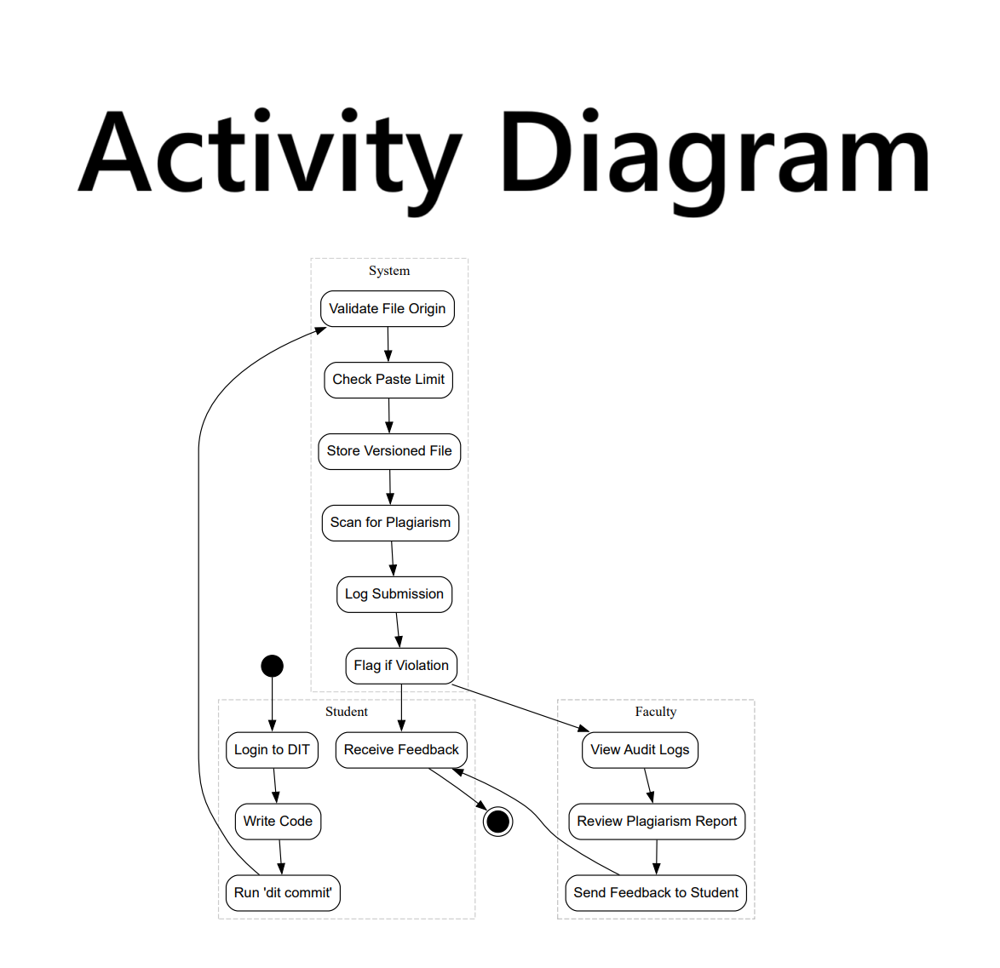
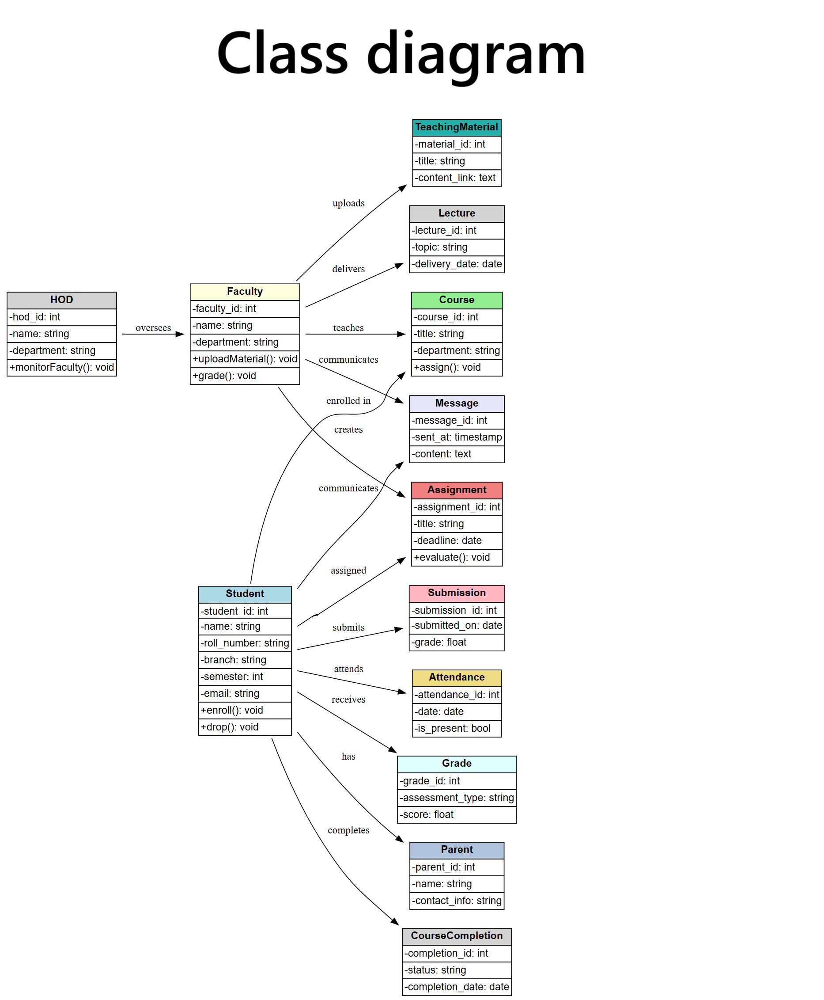
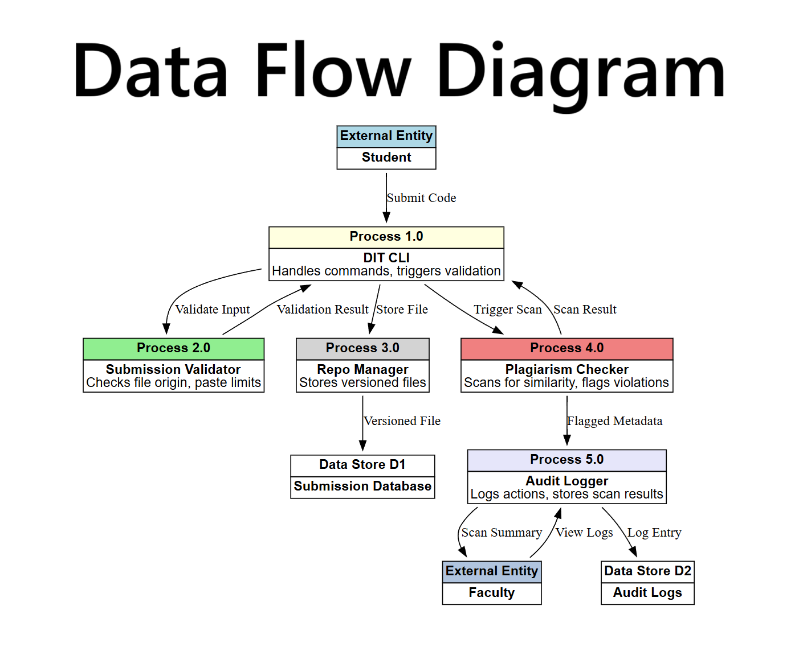
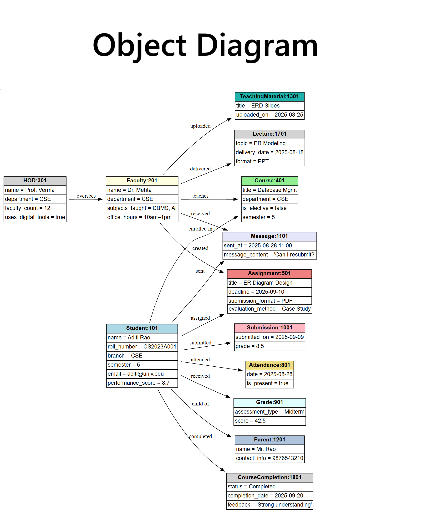
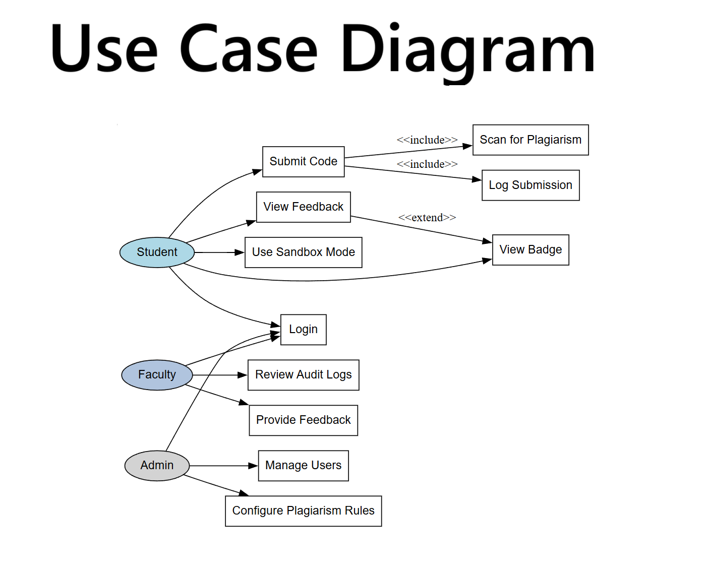
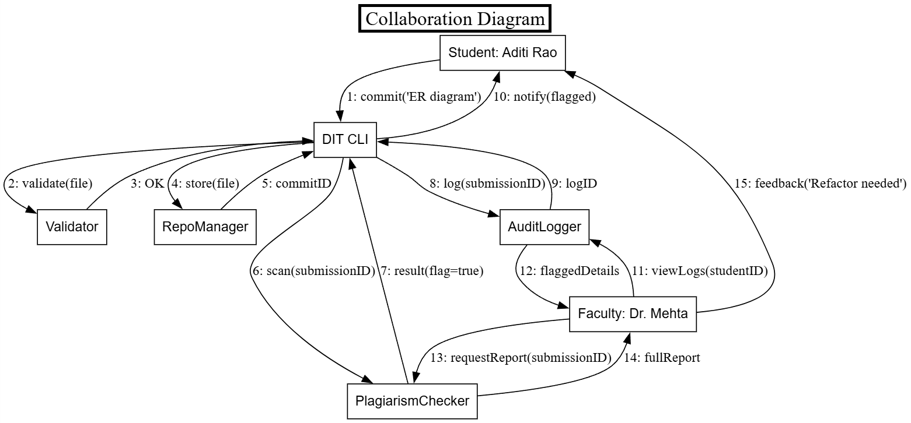

<<<<<<< HEAD

=======
### 🔷 Collaboration Diagram – DIT Submission & Review

#### 1. Definition  
A UML Collaboration Diagram models object interactions and message flow, emphasizing structure and communication sequence.

#### 2. Purpose  
- To visualize how system components (objects) collaborate to fulfill a workflow.  
- To track message flow and identify interaction responsibilities.

#### 3–9. Explanation  
3. The diagram shows seven key objects: Student, CLI, Validator, RepoManager, PlagiarismChecker, AuditLogger, and Faculty.  
4. Arrows represent directed messages, each labeled with a number for clarity.  
5. The student initiates the process by committing code via the CLI.  
6. The CLI interacts with Validator and RepoManager to validate and store the submission.  
7. PlagiarismChecker scans the submission and returns a flag result.  
8. AuditLogger logs the submission and makes it accessible to Faculty.  
9. Faculty reviews logs and scan reports, then sends feedback to the student.

#### 10. Layout Enhancements  
Manual positioning and spacing attributes ensure clean rectangular connectors and readable flow from top (Student) to bottom (Faculty).

---

### 🔷 Use Case Diagram – DIT Project

#### 1. Definition  
A **Use Case Diagram** is a UML behavioral diagram that represents system functionality from the perspective of external actors. It shows what the system does, not how it does it.

#### 2. Purpose  
- To identify and organize system requirements based on user interactions.  
- To clarify roles and responsibilities of different actors (e.g., Student, Faculty, Admin).

#### 3–9. Explanation  
3. The diagram includes three actors: Student, Faculty, and Admin.  
4. Each actor is connected to relevant use cases like `Submit Code`, `View Feedback`, `Review Logs`, and `Manage Users`.  
5. Use cases are represented as labeled boxes, grouped by role.  
6. Relationships include `<<include>>` for mandatory sub-processes (e.g., plagiarism scan) and `<<extend>>` for optional features (e.g., badge visibility).  
7. The Student interacts with CLI-driven actions like submitting code and viewing feedback.  
8. Faculty accesses logs and reports to provide feedback.  
9. Admin configures system rules and manages user access.

#### 10. Layout Enhancements  
The diagram uses clean actor-to-use-case links and modular grouping to reflect role-based access and system behavior.

---

---

### 🔷 Activity Diagram – DIT Submission & Review Workflow

#### 1. Definition  
An **Activity Diagram** is a UML behavioral diagram that models the flow of control or data from activity to activity, representing dynamic aspects of a system.

#### 2. Purpose  
- To visualize the step-by-step execution of a process or workflow.  
- To identify decision points, parallel actions, and role-specific responsibilities.

#### 3–9. Explanation  
3. The diagram begins with a `Start` node and ends with a `Stop` node, framing the workflow.  
4. Actions are grouped into swimlanes: Student, System, and Faculty, showing role-based responsibilities.  
5. The Student logs in, writes code, and runs the `dit commit` command.  
6. The System validates the submission, checks paste limits, stores the file, scans for plagiarism, and logs the result.  
7. If flagged, the Student receives feedback; otherwise, the flow ends.  
8. Faculty accesses logs, reviews scan reports, and sends feedback to the Student.  
9. The diagram uses rounded boxes for actions and arrows to show control flow, arranged top-to-bottom for clarity.

#### 10. Layout Enhancements  
Swimlanes and vertical spacing make the diagram readable and modular, clearly separating user actions from system logic.

---

---

### 🔷 Class Diagram – DIT System Architecture

#### 1. Definition  
A **Class Diagram** is a UML structural diagram that models the static structure of a system by showing its classes, attributes, methods, and relationships.

#### 2. Purpose  
- To define the blueprint of system components and their responsibilities.  
- To clarify how classes relate through associations, inheritance, and dependencies.

#### 3–9. Explanation  
3. The diagram includes core classes like `Student`, `Faculty`, `Submission`, `Validator`, `PlagiarismChecker`, `AuditLogger`, and `Repository`.  
4. Each class is represented as a box with three compartments: class name, attributes, and methods.  
5. `Student` and `Faculty` inherit from a common `User` superclass, sharing login and profile features.  
6. `Submission` is associated with `Student` and contains metadata like timestamp, file path, and status.  
7. `Validator` and `PlagiarismChecker` are service classes that operate on `Submission` objects.  
8. `AuditLogger` logs actions and is linked to both `Submission` and `Faculty` for traceability.  
9. `Repository` handles file storage and returns commit IDs, interacting with `Submission` and `Validator`.

#### 10. Layout Enhancements  
The diagram uses clear inheritance arrows, association lines, and method visibility markers (`+`, `-`) to distinguish public and private operations.

---

---

### 🔷 Object Diagram – DIT Runtime Snapshot

#### 1. Definition  
An **Object Diagram** is a UML structural diagram that captures a snapshot of system objects and their relationships at a specific moment during execution.

#### 2. Purpose  
- To visualize the actual instances of classes and their links at runtime.  
- To validate class structure and object interactions against real-world scenarios.

#### 3–9. Explanation  
3. The diagram shows instantiated objects like `student1:Student`, `submission1:Submission`, `validator1:Validator`, and `faculty1:Faculty`.  
4. Each object is labeled with its name and class type (e.g., `submission1:Submission`).  
5. Attribute values are shown inside objects, such as `status="flagged"` or `timestamp="2025-09-28T10:15"`.  
6. Links between objects represent actual associations, like `student1` owning `submission1`.  
7. `validator1` is linked to `submission1`, showing it has validated that instance.  
8. `faculty1` is connected to `logger1`, indicating access to audit logs.  
9. The diagram reflects a real-time state, useful for debugging or illustrating a specific scenario.

#### 10. Layout Enhancements  
Objects are spaced to reflect logical clusters (e.g., student-submission-validator), and links are directional to show ownership or access paths.

---

---

### 🔷 Data Flow Diagram – DIT Submission & Review

#### 1. Definition  
A **Data Flow Diagram** (DFD) is a graphical representation of how data moves through a system, showing processes, data stores, external entities, and data flows.

#### 2. Purpose  
- To model the logical flow of information between system components.  
- To identify inputs, outputs, transformations, and storage points in the workflow.

#### 3–9. Explanation  
3. The diagram includes external entities like `Student`, `Faculty`, and `Admin`, who interact with the system.  
4. Key processes are shown as circles or rounded rectangles: `Submit Code`, `Validate`, `Scan for Plagiarism`, `Log Submission`, `Review Logs`, and `Send Feedback`.  
5. Arrows represent data flows between entities, processes, and data stores.  
6. Data stores like `Repository`, `Audit Log`, and `Plagiarism Report` are shown as open-ended rectangles.  
7. The `Student` sends code to the `Submit Code` process, which routes it to `Validate` and `Repository`.  
8. `Scan for Plagiarism` accesses the stored submission and generates a report stored in `Plagiarism Report`.  
9. `Faculty` retrieves logs and reports, then sends feedback back to the `Student`.

#### 10. Layout Enhancements  
The diagram uses clear directional arrows, modular process blocks, and well-separated data stores to maintain readability and logical flow.

---

---

### 🔷 Sequence Diagram – DIT Submission & Review Flow

#### 1. Definition  
A **Sequence Diagram** is a UML interaction diagram that models the chronological order of message exchanges between objects over time.

#### 2. Purpose  
- To visualize the time-ordered flow of operations across system components.  
- To clarify how objects collaborate step-by-step to complete a process.

#### 3–9. Explanation  
3. The diagram includes lifelines for key objects: `Student`, `CLI`, `Validator`, `RepoManager`, `PlagiarismChecker`, `AuditLogger`, and `Faculty`.  
4. Vertical dashed lines represent object lifetimes; horizontal arrows show messages exchanged.  
5. The `Student` initiates the flow by invoking `commit()` on the `CLI`.  
6. `CLI` sequentially calls `validate()`, `store()`, and `scan()` on respective services.  
7. Each service returns a result (e.g., `OK`, `commitID`, `flag=true`) back to `CLI`.  
8. `CLI` logs the submission and notifies the `Student` if flagged.  
9. `Faculty` later queries `AuditLogger` and `PlagiarismChecker`, then sends feedback to the `Student`.

#### 10. Layout Enhancements  
The diagram uses clear arrow sequencing, activation bars for method calls, and top-down flow to reflect real-time execution order.

---

>>>>>>> 2335c1e854759a4bf62839f7e1aec3c02401984f
