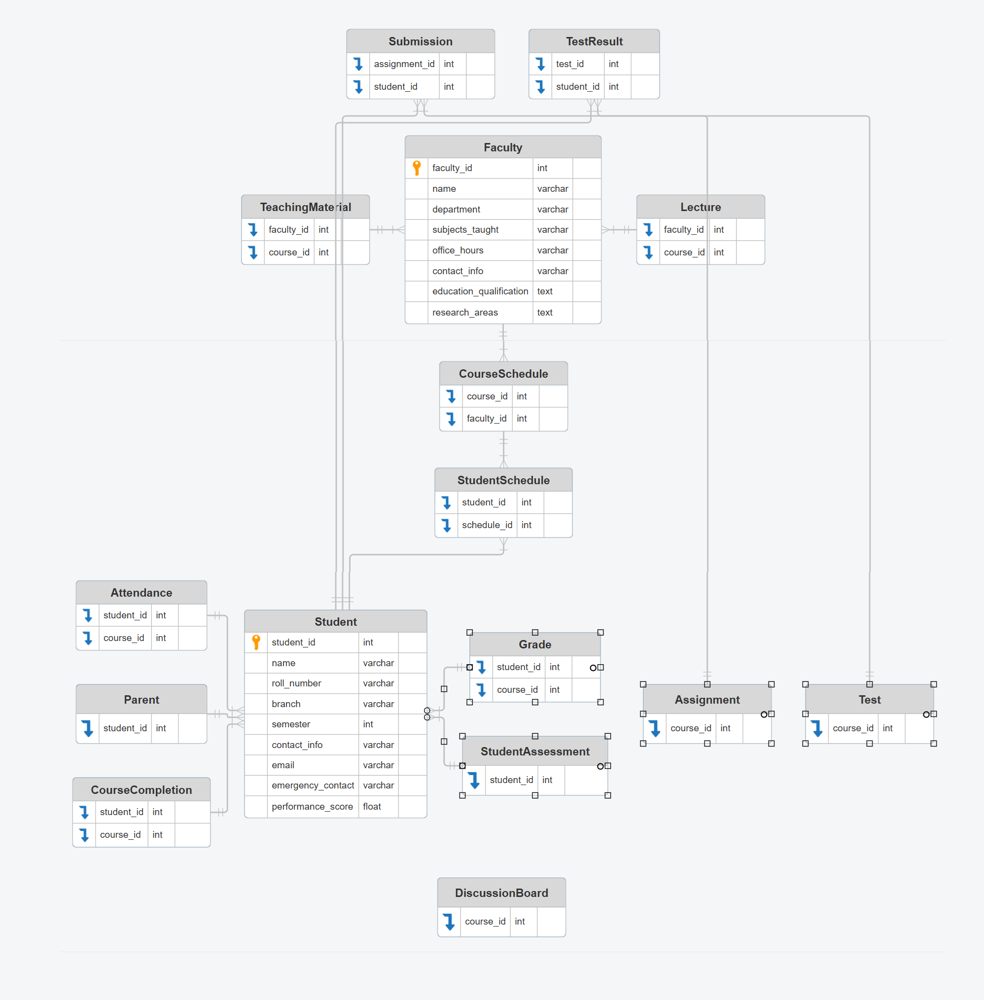

---

# 📘 Student Management System – Relational Model Documentation

## 🧑‍🎓 Student

```txt
Student(INT student_id, VARCHAR name, VARCHAR roll_number, VARCHAR branch, INT semester, VARCHAR contact_info, VARCHAR email, VARCHAR emergency_contact, FLOAT performance_score)
```

**Description**: Stores student profile and academic performance.

**Example**:
| student_id | name       | roll_number | branch | semester | email               | performance_score |
|------------|------------|-------------|--------|----------|---------------------|-------------------|
| 101        | Aditi Rao  | CS2023A001  | CSE    | 5        | aditi@univ.edu      | 8.7               |

---

## 👩‍🏫 Faculty

```txt
Faculty(INT faculty_id, VARCHAR name, VARCHAR department, VARCHAR subjects_taught, VARCHAR office_hours, VARCHAR contact_info, TEXT education_qualification, TEXT research_areas)
```

**Description**: Contains faculty details and academic responsibilities.

**Example**:
| faculty_id | name         | department | subjects_taught | office_hours | education_qualification |
|------------|--------------|------------|------------------|--------------|--------------------------|
| 201        | Dr. Mehta    | CSE        | DBMS, AI         | 10am–1pm     | PhD in AI                |

---

## 👨‍💼 HOD

```txt
HOD(INT hod_id, VARCHAR name, VARCHAR department, INT faculty_count, BOOLEAN uses_digital_tools, TEXT communication_channels)
```

**Description**: Head of Department profile and oversight tools.

**Example**:
| hod_id | name        | department | faculty_count | uses_digital_tools | communication_channels |
|--------|-------------|------------|----------------|---------------------|-------------------------|
| 301    | Prof. Verma | CSE        | 12             | true                | Email, WhatsApp         |

---

## 📚 Course

```txt
Course(INT course_id, VARCHAR title, VARCHAR department, BOOLEAN is_elective, INT semester)
```

**Description**: Academic course catalog.

**Example**:
| course_id | title         | department | is_elective | semester |
|-----------|---------------|------------|-------------|----------|
| 401       | Database Mgmt | CSE        | false        | 5        |

---

## 📝 Assignment

```txt
Assignment(INT assignment_id, INT course_id, VARCHAR title, DATE deadline, VARCHAR submission_format, VARCHAR evaluation_method)
```

**Description**: Assignment metadata linked to courses.

**Example**:
| assignment_id | course_id | title             | deadline   | submission_format | evaluation_method |
|---------------|-----------|-------------------|------------|-------------------|-------------------|
| 501           | 401       | ER Diagram Design | 2025-09-10 | PDF               | Case Study        |

---

## 📅 CourseSchedule & StudentSchedule

```txt
CourseSchedule(INT schedule_id, INT course_id, INT faculty_id, VARCHAR day, VARCHAR time_slot, VARCHAR room)
StudentSchedule(INT student_schedule_id, INT student_id, INT schedule_id, VARCHAR format_preference)
```

**Description**: Timetable structure for courses and student preferences.

**Example**:
| schedule_id | course_id | faculty_id | day   | time_slot | room |
|-------------|-----------|------------|-------|-----------|------|
| 601         | 401       | 201        | Mon   | 10–11am   | CSE101 |

| student_schedule_id | student_id | schedule_id | format_preference |
|---------------------|------------|-------------|-------------------|
| 701                 | 101        | 601         | Digital Calendar  |

---

## 📊 Attendance & Grade

```txt
Attendance(INT attendance_id, INT student_id, INT course_id, DATE date, BOOLEAN is_present)
Grade(INT grade_id, INT student_id, INT course_id, VARCHAR assessment_type, FLOAT score)
```

**Description**: Tracks student presence and performance.

**Example**:
| attendance_id | student_id | course_id | date       | is_present |
|---------------|------------|-----------|------------|------------|
| 801           | 101        | 401       | 2025-08-28 | true       |

| grade_id | student_id | course_id | assessment_type | score |
|----------|------------|-----------|------------------|-------|
| 901      | 101        | 401       | Midterm          | 42.5  |

---

## 📤 Submission

```txt
Submission(INT submission_id, INT assignment_id, INT student_id, DATE submitted_on, TEXT content, FLOAT grade)
```

**Description**: Assignment submissions and grading.

**Example**:
| submission_id | assignment_id | student_id | submitted_on | grade |
|---------------|---------------|------------|--------------|-------|
| 1001          | 501           | 101        | 2025-09-09   | 8.5   |

---

## 💬 Message

```txt
Message(INT message_id, INT sender_id, INT receiver_id, TIMESTAMP sent_at, TEXT message_content)
```

**Description**: Internal communication between users.

**Example**:
| message_id | sender_id | receiver_id | sent_at            | message_content        |
|------------|-----------|-------------|---------------------|------------------------|
| 1101       | 101       | 201         | 2025-08-28 11:00:00 | “Can I resubmit?”      |

---

## 👨‍👧 Parent

```txt
Parent(INT parent_id, VARCHAR name, VARCHAR contact_info, INT student_id)
```

**Description**: Parent linkage for student monitoring.

**Example**:
| parent_id | name         | contact_info | student_id |
|-----------|--------------|--------------|------------|
| 1201      | Mr. Rao      | 9876543210   | 101        |

---

## 📁 TeachingMaterial

```txt
TeachingMaterial(INT material_id, INT faculty_id, INT course_id, VARCHAR title, TEXT content_link, DATE uploaded_on)
```

**Description**: Learning resources uploaded by faculty.

**Example**:
| material_id | faculty_id | course_id | title             | uploaded_on |
|-------------|------------|-----------|-------------------|-------------|
| 1301        | 201        | 401       | ERD Slides        | 2025-08-25  |

---

## 🧮 StudentAssessment

```txt
StudentAssessment(INT assessment_id, INT student_id, INT semester, FLOAT total_score, VARCHAR grade, TEXT remarks, TIMESTAMP updated_at)
```

**Description**: Overall academic evaluation.

**Example**:
| assessment_id | student_id | semester | total_score | grade | remarks         |
|---------------|------------|----------|-------------|-------|-----------------|
| 1401          | 101        | 5        | 85.5        | A     | Excellent work  |

---

## 🧪 Test & TestResult

```txt
Test(INT test_id, INT course_id, VARCHAR title, DATE test_date, INT max_marks, VARCHAR evaluation_method)
TestResult(INT result_id, INT test_id, INT student_id, FLOAT marks_obtained, TEXT feedback)
```

**Description**: Exam records and student results.

**Example**:
| test_id | course_id | title         | test_date  | max_marks |
|---------|-----------|---------------|------------|-----------|
| 1501    | 401       | Midterm Exam  | 2025-08-20 | 50        |

| result_id | test_id | student_id | marks_obtained | feedback         |
|-----------|---------|------------|----------------|------------------|
| 1601      | 1501    | 101        | 42.5           | Good performance |

---

## 🎓 Lecture & CourseCompletion

```txt
Lecture(INT lecture_id, INT faculty_id, INT course_id, VARCHAR topic, DATE delivery_date, VARCHAR format, TEXT materials_link)
CourseCompletion(INT completion_id, INT student_id, INT course_id, VARCHAR status, DATE completion_date, TEXT feedback)
```

**Description**: Lecture logs and course completion status.

---
Here are the example datasets for the requested relations, based on the structured documentation from your GitHub repository:

---

## 🎓 Lecture & CourseCompletion

### `Lecture`

| lecture_id | faculty_id | course_id | topic            | delivery_date | format   | materials_link         |
|------------|------------|-----------|------------------|----------------|----------|------------------------|
| 1701       | 201        | 401       | ER Modeling      | 2025-08-18     | PPT      | /materials/erd.pptx    |
| 1702       | 201        | 401       | Normalization    | 2025-08-25     | Video    | /videos/normalization.mp4 |

### `CourseCompletion`

| completion_id | student_id | course_id | status     | completion_date | feedback             |
|----------------|------------|-----------|------------|------------------|----------------------|
| 1801           | 101        | 401       | Completed  | 2025-09-20       | Strong understanding |
| 1802           | 102        | 401       | Incomplete | NULL             | Missed final test    |

---

---

## 🧵 DiscussionBoard & NotificationPreference

```txt
DiscussionBoard(INT post_id, INT author_id, VARCHAR role, INT course_id, TEXT content, TIMESTAMP created_at)
NotificationPreference(INT preference_id, INT user_id, VARCHAR role, BOOLEAN notify_email, BOOLEAN notify_sms, BOOLEAN notify_app)
```
---
## 🧵 DiscussionBoard & NotificationPreference

### `DiscussionBoard`

| post_id | author_id | role   | course_id | content                         | created_at           |
|---------|-----------|--------|-----------|----------------------------------|----------------------|
| 1901    | 101       | student| 401       | “Can someone explain BCNF?”     | 2025-08-28 09:30:00  |
| 1902    | 201       | faculty| 401       | “Slides for ERD uploaded.”      | 2025-08-28 10:00:00  |

### `NotificationPreference`

| preference_id | user_id | role    | notify_email | notify_sms | notify_app |
|----------------|---------|---------|---------------|-------------|-------------|
| 2001           | 101     | student | true          | false       | true        |
| 2002           | 201     | faculty | true          | true        | false       |

---
**Description**: Student engagement and notification settings.

---

## 📊 StudentPerformanceDashboard & FacultyLectureLog

```txt
StudentPerformanceDashboard(INT student_id, VARCHAR name, FLOAT total_score, VARCHAR course_status, FLOAT marks_obtained, VARCHAR grade)
FacultyLectureLog(INT faculty_id, VARCHAR name, VARCHAR topic, DATE delivery_date, TEXT materials_link)
```

**Description**: Aggregated views for oversight and reporting.

---

## 📊 StudentPerformanceDashboard & FacultyLectureLog

### `StudentPerformanceDashboard`

| student_id | name       | total_score | course_status | marks_obtained | grade |
|-------------|------------|--------------|----------------|------------------|--------|
| 101         | Aditi Rao | 85.5         | Completed      | 42.5             | A      |
| 102         | Ravi Singh| 62.0         | Incomplete     | 28.0             | C      |

### `FacultyLectureLog`

| faculty_id | name       | topic         | delivery_date | materials_link         |
|-------------|------------|---------------|----------------|------------------------|
| 201         | Dr. Mehta | ER Modeling   | 2025-08-18     | /materials/erd.pptx    |
| 201         | Dr. Mehta | Normalization | 2025-08-25     | /videos/normalization.mp4 |

---

---

---

## 🤖 AssignmentAITrainingData
```txt
AssignmentAITrainingData(INT submission_id,INT student_id,INT assignment_id,VARCHAR file_origin,INT paste_event_count,INT paste_char_max,BOOLEAN paste_violation_flag,BOOLEAN line_by_line_pattern,FLOAT similarity_score,BOOLEAN plagiarism_flag,VARCHAR evaluation_method,FLOAT grade_awarded,TEXT feedback_comments,BOOLEAN sandbox_mode_used,TIMESTAMP submitted_on,VARCHAR automation_detected_type,BOOLEAN ethical_intent_flag,VARCHAR badge_awarded)

```

**Description**: Captures AI-enhanced metadata for assignment submissions, used for ethical coding evaluation, automation detection, and badge-based feedback.

**Example Dataset**:

| submission_id | student_id | assignment_id | file_origin | paste_event_count | paste_char_max | paste_violation_flag | line_by_line_pattern | similarity_score | plagiarism_flag | evaluation_method | grade_awarded | sandbox_mode_used | submitted_on         | automation_detected_type | ethical_intent_flag | badge_awarded        |
|---------------|------------|----------------|-------------|-------------------|----------------|-----------------------|-----------------------|------------------|------------------|--------------------|----------------|--------------------|------------------------|--------------------------|----------------------|-----------------------|
| 2001          | 101        | 501            | DIT_editor  | 3                 | 120            | true                  | false                 | 0.78             | true             | manual             | 7.5            | true               | 2025-09-09 10:30:00    | macro                    | true                 | Automation Architect  |

---
## ER DIAGRAM 
---
